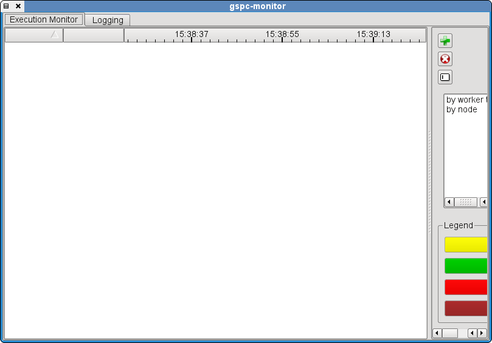
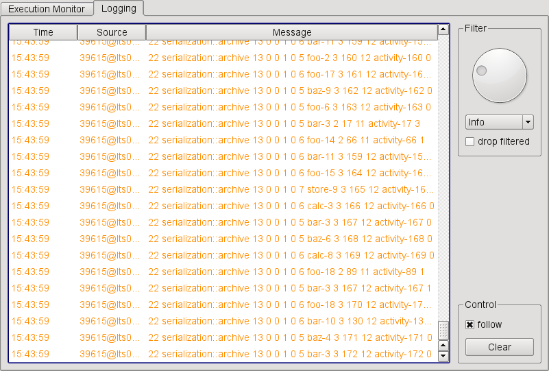
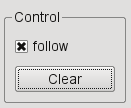
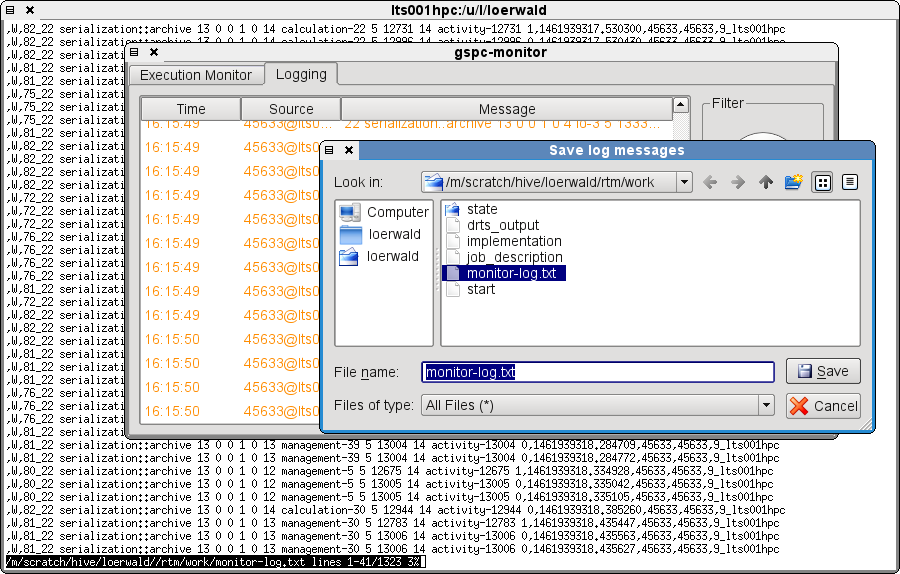
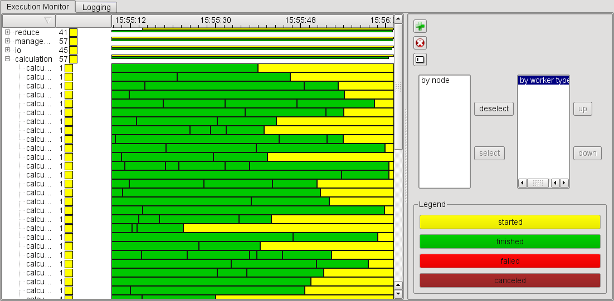
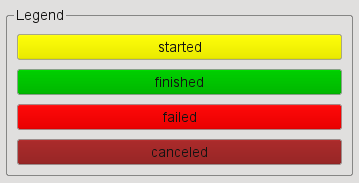
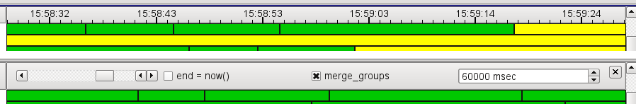
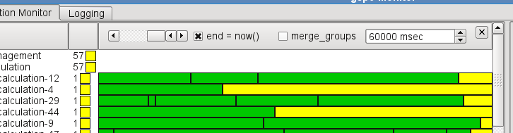
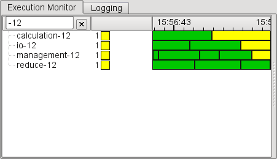

The GPI-Space Monitor
=====================

The command

[source,bash]
$MASTER:shared> QT_GRAPHICSSYSTEM=native                      \
                .../gpispace/bin/gspc-monitor                 \
                --gui-port $GUI_PORT                          \
                --log-port $LOG_PORT

starts the GPI-Space monitor which provides a dynamic Gantt chart of
the current state of the distributed runtime system as well as
application logging output.

The GPI-Space monitor can be started and stopped at any time and it
observes all running jobs that share the +$GUI_PORT+ and +$LOG_PORT+,
as specified when starting an application and monitor.

After startup of the gspc-monitor, there is one window with two tabs,
the "Execution Monitor" and the "Logging" window.

.Overview of the GPI-Space Monitor after startup

Logging
-------

In the "Logging" window the log output of all components of the
distributed system is displayed. Use this to see the output of the
application. On the right there are controls to adjust the log level and
to clear the log window. Dropping filtered log entries can help to
avoid performance issues when receiving a lot of unwanted lines,
e.g. due to debugging output. There is a hardcoded limit of 10000
lines of log output being kept, after which lines will be evicted in a
circular buffer style. The log may also be manually cleared by
clicking +Clear+ on the right hand bottom.

.Logging window of the GPI-Space Monitor

By default, the log window automatically scrolls to the bottom, to
always show new messages. This can be disabled by unchecking the
+follow+ box above the +Clear+ button.

.+Clear+ and +follow+ controls

In order to analyze the log or sharing it with others, it can be saved
by presing ctrl+s when in the Logging tab. It will ask for a filename
and save to the user specified location, using a text based
serialization format, allowing to process the output with standard
command line tools.

.Saving the log window's contents to a file

Execution Monitor
-----------------

The execution monitor shows a gantt diagram style overview of the
workers and the jobs they are executing. There is one line per worker
in the system. On the right hand side there is a panel showing options
and actions. The panel can be resized using the splitter and may be
hidden.

.Execution Monitor window of the GPI-Space Monitor

Each line contains blocks that represent tasks a worker is
executing. The workers' names in the first column contain their role,
the host as well as their PID and an internal identifier. The second
column shows a summary representation of the current usage, followed
by a large third column containing the tasks plotted over time.

NOTE: Workers only show up after getting their first job after
starting the monitor. If the monitor is started after workers got long
running jobs, the gantt might indicate that no worker is running,
while they in fact are all busy.

NOTE: Coallocation jobs do not have an intuitive representation but
rather show to start on all workers and instantly finishing on all but
one workers. This might lead to empty lines even though the workers
are in use by a coallocation job.

Task-blocks are color coded by state: In the default configuration, a
running job is yellow, a finished job is green, a failed one is red,
and a job that was cancelled due to user request or a different job
failing is marked in dark red. The colors can be configured by
clicking onto the respective entry in the legend on the options pane.

.Legend for task colors

The two list boxescan be used to arrange the workers in groups, either
by their type or by the node they are running on. Filters can be
selected by double clicking or using +deselect+ and +select+, and may
be reordered by dragging or pressing +up+ and +down+. This will result
in the task view showing one line per group, which can be expanded to
show the individual workers again. The "current state" and "gantt"
columns will show the sum of grouped workers, i.e. the number of jobs
running in the group.

Of the buttons on the top right, the +Clear+ button is the most
important one. It removes all the entries from the execution
monitor. The other two buttons add and remove columns which then can
be configured by left, right or double clicking on their header,
depending on column type.

.+Clear+ button for Execution Monitor

Double clicking the gannt column's header allows to change the time
scale in milliseconds (input box on the right) as well as the visible
time range (scrollbar on the left). Doing the latter will
automatically disable the continous scrolling, which can be re-enabled
by toggling the +end = now()+ box. The time range can also be changed
by using the scroll wheel on top of the header when options are not
visible. To avoid performance issues with large numbers of grouped
workers, the gantt column can also disable merging the tasks,
independent of the "current state" column, by toggling
+merge_groups+. This has no effect on non-grouped rows of the
execution monitor.

.Closed and opened column header options for gantt column

.Disabled merging of groups in gantt column

The worker name column's header can be clicked to change sort order
and double clicked to allow filtering by worker names by pretty
forgiving regular expression style patterns.

.Execution Monitor entries filtered by worker name

