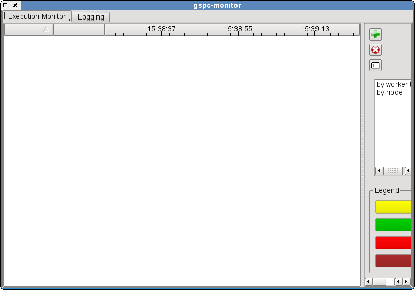
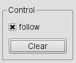
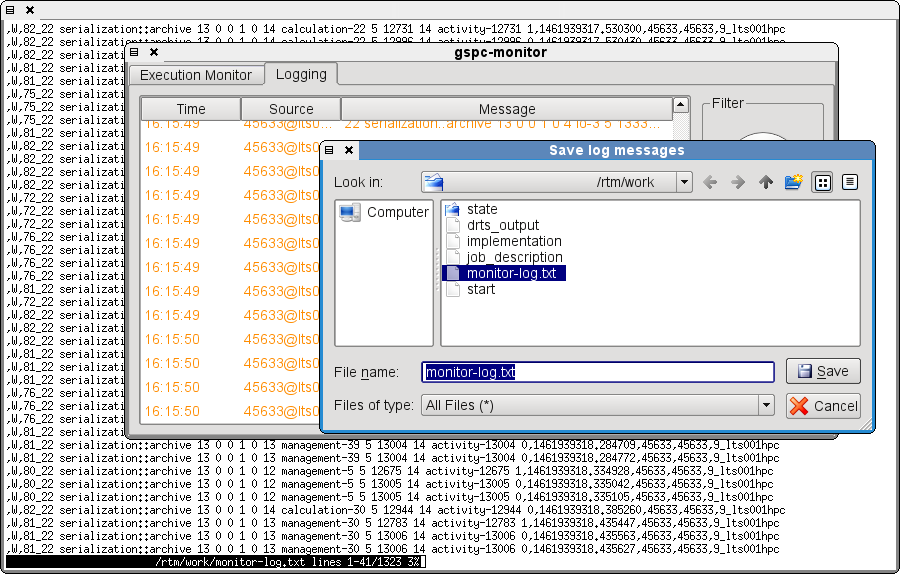
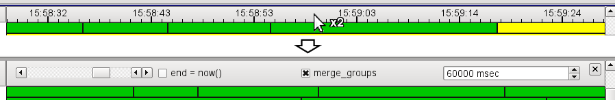

# The GPI-Space Monitor

The GPI-Space monitor provides a dynamic Gantt chart of the current
state of the distributed runtime system as well as application logging
output. Components within the runtime system are emitting messages to
registered subscribers. The monitor is one possible subscriber. There
are two ways to use it:

```bash
$MASTER:shared> QT_GRAPHICSSYSTEM=native                      \
                .../gpispace/bin/gspc-monitor                 \
                --port $LOG_PORT
```

starts a monitor that will listen for emitters on `$LOG_PORT`, which
can be given to the GSPC runtime system with `--log-host $MASTER
--log-port $LOG_PORT` for it to set up subscriptions. Alternatively,

```bash
$MASTER:shared> QT_GRAPHICSSYSTEM=native                      \
                .../gpispace/bin/gspc-monitor                 \
                --emitters "${EMITTER_STRING}"
```

will start a monitor that attaches to an existing emitter. The
`--emitters` option can be given multiple times, and the both
arguments can be provided at the same time.

The monitor can be reused for multiple jobs, by either giving host and
port for the same monitor to multiple jobs, or by pressing the `Add
emitters` button during runtime of the monitor, and adding the log
emitter which is automatically started when starting the runtime
system and is printed within the startup messages. Note that when
giving the runtime system logging information it will require that to
exist.

After startup of the gspc-monitor, there is one window with two tabs,
the "Execution Monitor" and the "Logging" window.

<figure align="center">
  
  <figcaption>
    <small><i>Overview of the GPI-Space Monitor after startup</i></small>
  </figcaption>
</figure>


## Logging

In the "Logging" window the log output of all components of the
distributed system is displayed. Use this to see the output of the
application. On the right there are controls to adjust the log level and
to clear the log window. Dropping filtered log entries can help to
avoid performance issues when receiving a lot of unwanted lines,
e.g. due to debugging output. There is a hardcoded limit of 10000
lines of log output being kept, after which lines will be evicted in a
circular buffer style. The log may also be manually cleared by
clicking `Clear` on the right hand bottom.

<figure align="center">
  
  <figcaption>
    <small><i>Logging window of the GPI-Space Monitor</i></small>
  </figcaption>
</figure>

By default, the log window automatically scrolls to the bottom, to
always show new messages. This can be disabled by unchecking the
`follow` box above the `Clear` button.

<figure align="center">
  Clear</code> and <code>follow</code> controls">
  <figcaption>
    <small><i><code>Clear</code> and <code>follow</code> controls</i></small>
  </figcaption>
</figure>

In order to analyze the log or sharing it with others, it can be saved
by pressing _Ctrl+s_ when in the Logging tab. It will ask for a filename
and save to the user specified location, using a text based
serialization format, allowing to process the output with standard
command line tools.

<figure align="center">
  
  <figcaption>
    <small><i>Saving the log window's contents to a file</i></small>
  </figcaption>
</figure>


## Execution Monitor

The execution monitor shows a gantt diagram style overview of the
workers and the jobs they are executing. There is one line per worker
in the system. On the right hand side there is a panel showing options
and actions. The panel can be resized using the splitter and may be
hidden.

<figure align="center">
  
  <figcaption>
    <small><i>Execution Monitor window of the GPI-Space Monitor</i></small>
  </figcaption>
</figure>

Each line contains blocks that represent tasks a worker is
executing. The workers' names in the first column contain their role,
the host as well as their PID and an internal identifier. The second
column shows a summary representation of the current usage, followed
by a large third column containing the tasks plotted over time.

> ---
> **Note:**
>
> Workers only show up after getting their first job after
> starting the monitor. If the monitor is started after workers got long
> running jobs, the gantt might indicate that no worker is running,
> while they in fact are all busy.
>
> ---

> ---
> **Note:**
>
> Jobs that use more than one worker do not have an intuitive
> representation but rather show to start on all workers and instantly
> finishing on all but one workers. This might lead to empty lines even
> though the workers are (indirectly) in use by a job.
>
> ---

Task-blocks are color coded by state: In the default configuration, a
running job is yellow, a finished job is green, a failed one is red,
and a job that was cancelled due to user request or a different job
failing is marked in dark red. The colors can be configured by
clicking onto the respective entry in the legend on the options pane.

<figure align="center">
  
  <figcaption>
    <small><i>Legend for task colors</i></small>
  </figcaption>
</figure>

The two list boxes can be used to arrange the workers in groups,
either `by worker type` or `by node` they are running on. Filters can be
selected by double clicking or using `deselect` and `select`, and may
be reordered by dragging or pressing `up` and `down`. This will result
in the task view showing one line per group, which can be expanded to
show the individual workers again. The "current state" and "gantt"
columns will show the sum of grouped workers, i.e. the number of jobs
running in the group.

Of the buttons on the top right, the `Clear` button is the most
important one. It removes all the entries from the execution
monitor. The other two buttons add and remove columns which then can
be configured by left, right or double clicking on their header,
depending on column type.

<figure align="center">
  Clear</code> button for Execution Monitor">
  <figcaption>
    <small><i><code>Clear</code> button for Execution Monitor</i></small>
  </figcaption>
</figure>

Double clicking the gantt column's header allows to change the time
scale in milliseconds (input box on the right) as well as the visible
time range (scrollbar on the left). Doing the latter will
automatically disable the continous scrolling, which can be re-enabled
by toggling the `end = now()` box. The time range can also be changed
by using the scroll wheel on top of the header when options are not
visible. To avoid performance issues with large numbers of grouped
workers, the gantt column can also disable merging the tasks,
independent of the "current state" column, by toggling
`merge_groups`. This has no effect on non-grouped rows of the
execution monitor.

<figure align="center">
  
  <figcaption>
    <small><i>Closed and opened column header options for gantt column</i></small>
  </figcaption>
</figure>

<figure align="center">
  
  <figcaption>
    <small><i>Disabled merging of groups in gantt column</i></small>
  </figcaption>
</figure>

The worker name column's header can be clicked to change sort order
and double clicked to allow filtering by worker names by pretty
forgiving regular expression style patterns.

<figure align="center">
  
  <figcaption>
    <small><i>Execution Monitor entries filtered by worker name</i></small>
  </figcaption>
</figure>
