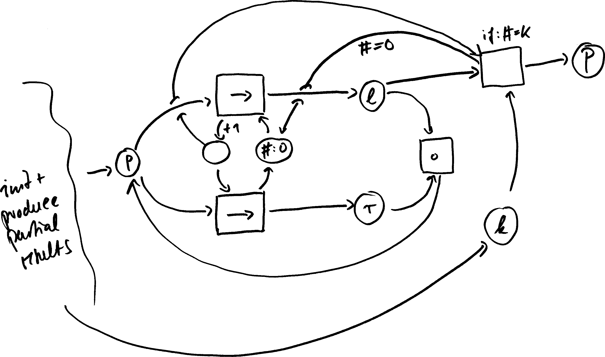

## Examples for parallel reduce

### What is a (parallel) reduce?

Denote by $`p_0,p_1,...,p_{k-1}`$ the $`k > 0`$ partial results, by $`·`$ a binary operator, by $`þ`$ a permutation of the numbers $`{0,1,...,k-1}`$ and by $`P(þ) = p_þ(0) · p_þ(1) · ... · p_þ(k-1)`$ the reduced result with respect to $`þ`$. If $`·`$ is commutative, then $`P(þ) = P(þ')`$  for any permutations $`þ`$ and $`þ'`$. If $`·`$ is also associative, then $`P(þ)`$ is independent from the order in which $`·`$ is applied, e.g. $`(p_þ(0) · p_þ(1)) · ... · p_þ(k-1) = p_þ(0) · (p_þ(1) · ... · p_þ(k-1))`$. In particular if $`·`$ is commutative and associative, then $`P(þ)`$ can be computed in parallel.

Note: Any execution (any order, sequential or parallel) corresponds to a term that has exactly $`k - 1`$ inner nodes labeled $`·`$. For example if $`k = 5`$:

- Sequential right to left $`p_0 · (p_1 · (p_2 · (p_3 · p_4)))`$

- Sequential left to right $`(((p_0 · p_1) · p_2) · p_3) · p_4`$

- One parallel execution $`(p_0 · p_1) · ((p_2 · p_3) · p_4)`$

In other words: The number of operations is independent from the execution order and the parallelism and is always equal to $`k - 1`$.

The amount of parallelism is: If $`n`$ partial results are available, then up to $`n / 2`$ reduction operations can be executed in parallel. So in the best case, the reduction of $`k`$ elements can be done in $`\mbox{log}_2 (k)`$ steps, namely $`k / 2^1`$ parallel reductions in the first step, then $`k / 2^2`$ in the second and up to $`1 = k / 2^\mbox{log}_2(k)`$ parallel reductions in the $`\mbox{log}_2(k)`$-th step. The best case requires $`k/2`$ available resources and all $`k`$ partial results to be available at the same time. In the worst case either the results are produced with a slow rate or the available resources are limited such that only $`1`$ reduction can be executed at the same time and the total execution requires $`k-1`$ steps. Which means that the parallel reduction pattern is never slower compared to a sequential reduction but might be exponentially faster.

### Manual implementations

The implementations in

    expression/manual.xpnet
    module_call/manual.xpnet

are implementing a parallel reduction "by hand". The difference being that the implemetation is inside an expression or an module call. Both tests are checking that the results are correct. The test for the module call based implementation also checks there is parallelism extracted. In order to do so, the module call is "hold back" by the job server until either all workers are used or jobs must be released in order to proceed with the reduction. Note that the expression version is executed inside of the workflow engine, in sequence.

The implemented network has the structure

The network computes the correct result in parallel:

- If `k == 1`, then one partial result is produced and moved via `l` to `P`

- If `k > 1`, then the partial results from `p` are distributed on `l` and `r` and enable (multiple) execution(s) of `·`. There is no conflict on the place `l` as `# == k` can only hold after the results of `·` are put back onto `p`, eventually leading to the case `k == 1`. In other words: If `k == 1`, then there is no token on `r`. The counter itself is incremented for each call to `·` and every time there only one partial result left on `l` (and no partial result on neither `p` nor on `r`), then the counter equals the number of partial results that are reduced into `l`.
